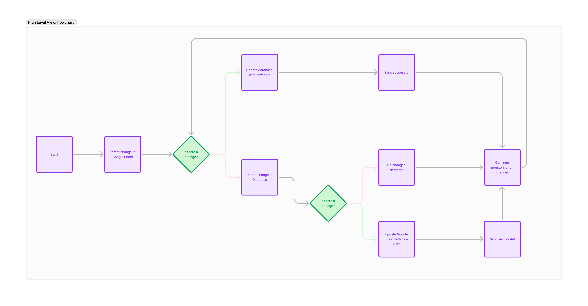

# Superjoin Hiring Assignment

### Welcome to Superjoin's hiring assignment! 🚀

### Objective
Build a solution that enables real-time synchronization of data between a Google Sheet and a specified database (e.g., MySQL, PostgreSQL). The solution should detect changes in the Google Sheet and update the database accordingly, and vice versa.

### Problem Statement
Many businesses use Google Sheets for collaborative data management and databases for more robust and scalable data storage. However, keeping the data synchronised between Google Sheets and databases is often a manual and error-prone process. Your task is to develop a solution that automates this synchronisation, ensuring that changes in one are reflected in the other in real-time.

### Requirements:
1. Real-time Synchronisation
  - Implement a system that detects changes in Google Sheets and updates the database accordingly.
   - Similarly, detect changes in the database and update the Google Sheet.
  2.	CRUD Operations
   - Ensure the system supports Create, Read, Update, and Delete operations for both Google Sheets and the database.
   - Maintain data consistency across both platforms.
   
### Optional Challenges (This is not mandatory):
1. Conflict Handling
- Develop a strategy to handle conflicts that may arise when changes are made simultaneously in both Google Sheets and the database.
- Provide options for conflict resolution (e.g., last write wins, user-defined rules).
    
2. Scalability: 	
- Ensure the solution can handle large datasets and high-frequency updates without performance degradation.
- Optimize for scalability and efficiency.

## Submission ⏰
The timeline for this submission is: **Next 2 days**

Some things you might want to take care of:
- Make use of git and commit your steps!
- Use good coding practices.
- Write beautiful and readable code. Well-written code is nothing less than a work of art.
- Use semantic variable naming.
- Your code should be organized well in files and folders which is easy to figure out.
- If there is something happening in your code that is not very intuitive, add some comments.
- Add to this README at the bottom explaining your approach (brownie points 😋)
- Use ChatGPT4o/o1/Github Co-pilot, anything that accelerates how you work 💪🏽. 

Make sure you finish the assignment a little earlier than this so you have time to make any final changes.

Once you're done, make sure you **record a video** showing your project working. The video should **NOT** be longer than 120 seconds. While you record the video, tell us about your biggest blocker, and how you overcame it! Don't be shy, talk us through, we'd love that.

We have a checklist at the bottom of this README file, which you should update as your progress with your assignment. It will help us evaluate your project.

- [ ] My code's working just fine! 🥳
- [ ] I have recorded a video showing it working and embedded it in the README ▶️
- [ ] I have tested all the normal working cases 😎
- [ ] I have even solved some edge cases (brownie points) 💪
- [x] I added my very planned-out approach to the problem at the end of this README 📜

## Got Questions❓
Feel free to check the discussions tab, you might get some help there. Check out that tab before reaching out to us. Also, did you know, the internet is a great place to explore? 😛

We're available at techhiring@superjoin.ai for all queries. 

All the best ✨.

## Developer's Section

### My Approach

- I started off by analysing the problem statement and coming up with a high level view in order to understand what I should be doing and how I should be approaching this problem

- Since I am most comfortable with Python and MySQL, I chose to use these in building this solution.
- Libraries Used:
  
  - Flask
  - google.oauth2.credentials
  - google_auth_oauthlib.flow
  - googleapiclient.discovery
  - google.auth.transport.requests
  - mysql.connector
  - os
  - time
  - re
  
- Additionally, to expose the Flask endpoint so that it could be accessed by the Apps Script code, I used ngrok to expose the Flask application. The downside of this is that if for some reason I need to run ngrok multiple times to expose the server, then the URL that is in the Apps Script code must be modified

- I started off by trying to immediately dynamically handle all changes which did not work as expected. Hence, I switched to focusing on making synchronization in one direction work properly, albeit with restrictions - We have a fixed schema both on the Google Sheets and the MySQL end.

- To dynamically handle any changes to the sheet this is what I plan to implement:

  - Each sheet in a Google Sheet corresponds to a table in the database
  - Adding a sheet leads to adding a table. Renaming a sheet renames the table
  - Adding columns adds columns in the table and renaming them renames in the table. 
  - To identify column headers, I plan to use regex to check if the cell number of the value most recently changed has a 1 in it - this tells us that it is a column header
  - Likewise any edits/insertions in the sheet will merit the same in the database.
  - Using regex and ord(), we figure out which column had a value changed, then we run a DESC \<Table Name>; to understand the structure of the table and use it to craft our query such that the correct record is updated.
  - From the MySQL side, implementing a constantly running thread that is always checking for updates is extremely heavy and can cause performance issues in case of large loads.
  - I plan to implement a polling based update mechanism which checks every 10s to see if there have been any modifications and then updates the Google sheet based on these modifications.
  - To do this, I plan to implement a trigger that runs after insertion or after updating a record which puts the most recently updated value in a 'halfway-table'. The polling will read from this table, immediately clear it to avoid conflicts that may arise if the trigger is triggered when polling occurs and then push the changes to the Google Sheets.

#### Additional Thoughts

Some edge cases that I thought of include:

- Merging of cells in the Google Sheet
- Applying filters and such in the Google Sheet
- Charts and other graphics that would modify cell contents and thereby trigger the webhook
- Tables and Pivot Tables in the Google Sheet would possibly need to be represented in the database
- While primary keys having unique values can be and is enforced in the database, the same is not mandated in Google Sheets. In other words, what is the primary key in the database can have duplicate entries in the Google Sheet. The question arises here, which record do you consider as the valid one?

#### Resources Used

- [Syncing Google Sheets to a database via REST API’s](https://www.youtube.com/watch?v=ftxroBc7mi4)
- [Apps Script](https://developers.google.com/apps-script/api/concepts)
- [ChatGPT](https://chatgpt.com/)

*Add your video here, and your approach to the problem (optional). Leave some comments for us here if you want, we will be reading this :)*
